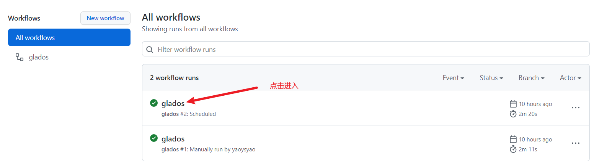
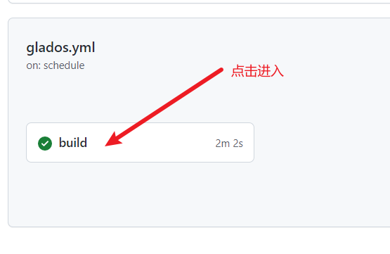
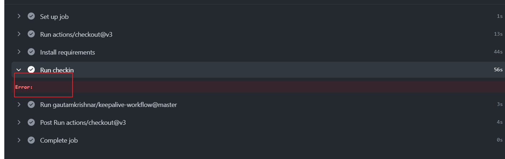
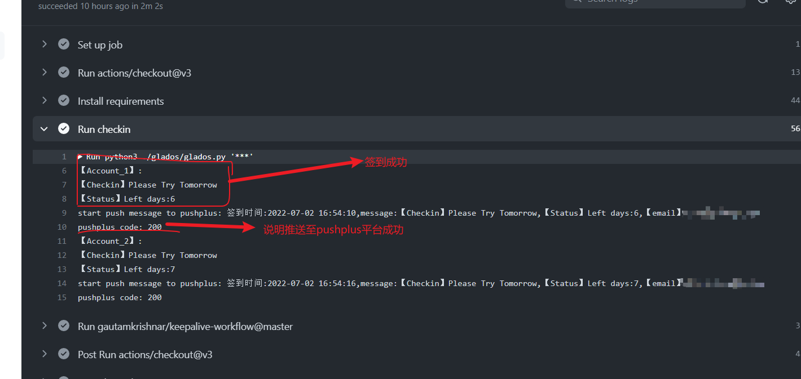
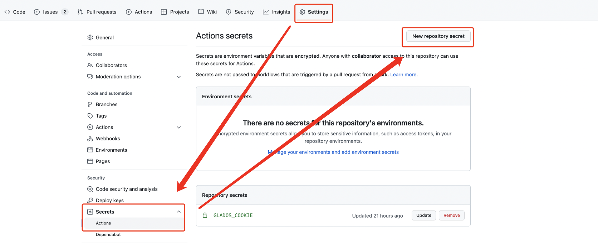
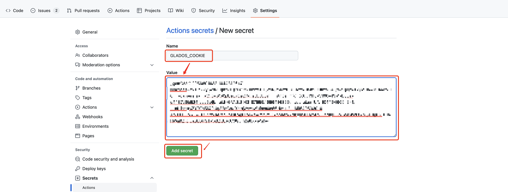
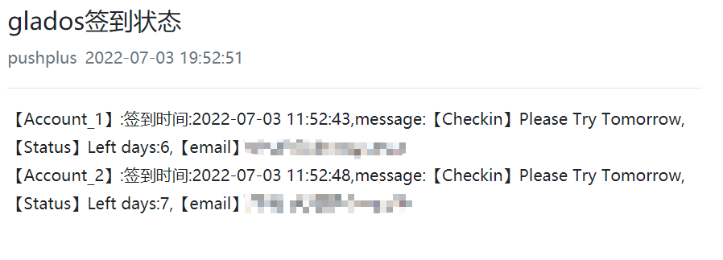
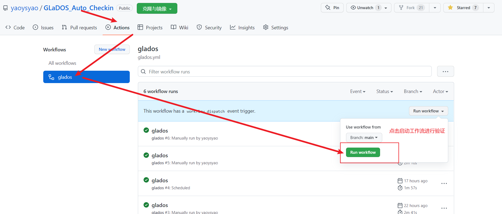

# GLaDOS_Checkin

## 功能描述

1. 每日自动进行签到（本项目可通过CloudFlare反爬机制）
2. 支持多用户签到，多个Cookie之间采用`&&`手动分割
3. 本项目可触发Github Notifications，出现Cookie过期/签到失败等可自动发送Email
4. 本项目包含Github Actions keep alive模块，可自动激活Github Actions
5. 支持推送消息到pushplus平台，server酱也可以支持，如果需要请提出

#### 重要！重要！

在fork本项目并配置完成后，请启动工作流并检查是否已经执行签到

  

  

如果查看checkin的时候出现error，请多尝试几次,如果日志中出现错误，请提出

  

  

## 使用方法

### 1. 添加 Cookie 至 Secrets

- 登陆[GLaDOS](https://glados.rocks/)后，F12打开开发者工具。
- 刷新网页，并在浏览器中提取复制`Cookie`项（本程序可处理`Cookie:`前缀，使用者复制该项时是否具有前缀均可)

  

- 在项目页面，依次点击`Settings`-->`Secrets`-->`Actions`-->`New repository secret`

  

- 建立名为`GLADOS_COOKIE`的 secret，值为复制的`Cookie`内容，最后点击`Add secret`
- secret名字必须为`GLADOS_COOKIE`，大小写敏感
- 支持多用户签到，多个Cookie之间采用`&&`手动分割完成后填入`GLADOS_COOKIE`即可
- 为保护隐私，不在日志中输出任何Id信息，请自行分辨账号顺序

  

### 2. 添加 PUSHPLUS_TOKEN 至 Secrets,如果不想推送通知可以不填写此项

- 建立名为`PUSHPLUS_TOKEN`的 secret，值为复制的`pushplus（推送加平台的token）`，最后点击`Add secret`
- 登陆[pushplus](http://www.pushplus.plus/)

  

- 推送消息详情,所有的账号签到状态均在一个推送通知中显示

#### 为保证隐私安全，在工作流日志不输出账号的信息，在推送消息中将推送账号邮箱，便于查看每个账号是否签到成功

  

### 3. 启用 Actions

- 在项目页面，依次点击`Actions`-->`glados`-->`Run workflow`-->`Run workflow`以激活Actions

  

- 本项目由Workflow控制，每日0时30分自动执行。
- 本项目目前可以正常运行，如果有其他使用问题请在Issues留言。
## GLaDOS automatic check-in bypassing CloudFlare using github action 此项目代码在[大佬原项目代码，点击进入](https://github.com/tyIceStream/GLaDOS_Checkin.git)的基础上进行修改，增加了推送消息到pushplus平台
